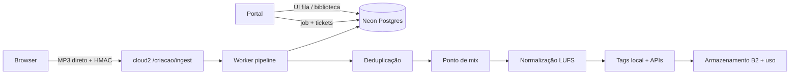
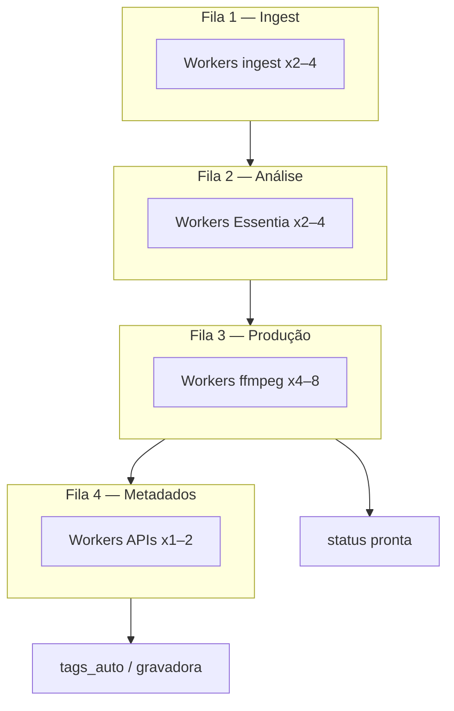

# Criação musical — processamento de faixas (arquitetura e escala)

Documento de referência para o **pipeline de upload e processamento** do módulo Criação (`/criacao/*`).

**Data:** 2026-06-19  
**Status:** fundação acordada — implementação em camadas (teste → produção)  
**Produção portal:** https://portal.radioibiza.app.br (Netlify)  
**Processamento pesado:** cloud2 (`cloud2.radioibiza.app.br`) — binários **não** passam pelo Netlify

---

## 1. Objetivo

Construir desde cedo a **forma** que aguenta volume alto (centenas/milhares de faixas/dia), ligando **capacidade** (workers, VMs) só quando o volume pedir.

**Teste:** 1 worker, fila única, processamento mais lento — aceitável.  
**Produção:** mesma base (Neon + cloud2 + B2), com **N workers** e **filas por etapa** — sem reescrever o portal.

Meta de longo prazo: processamento **rápido, paralelo, previsível e resiliente** (dedupe cedo, metadados async, observabilidade por etapa).

---

## 2. Arquitetura atual (implementado)



### Peças e responsabilidades

| Peça | Onde | Papel |
|------|------|--------|
| **Portal (Netlify)** | Este repo | Criar job, tickets HMAC, UI fila/biblioteca/upload — **sem CPU pesada** |
| **Browser** | Cliente | Envia MP3 **direto** ao cloud2 (FormData + token) |
| **cloud2** | VM Envyron (`portal-ibiza`) | Ingest, ffmpeg, Essentia, dedupe, gravação |
| **Neon** | Postgres | `processamento_job`, `processamento_item`, `musica_biblioteca` |
| **B2** | Backblaze | Master 192k (frio); reprocessamento a partir dele |
| **Disco cloud2** | NVMe/local | Versões de **uso** (MP3 que o player toca) |

### Etapas lógicas do job (hoje)

Definidas em `lib/criacao/filaService.ts`:

| Etapa | Conteúdo |
|-------|----------|
| `upload` | Receber binário, gravar temp |
| `deduplicacao` | `content_hash`, Chromaprint, AcoustID |
| `ponto_mix` | Análise de energia (Essentia) — crossfade |
| `normalizacao` | LUFS / true peak (ffmpeg) |
| `tags` | BPM, mood, APIs externas |
| `armazenamento` | Master B2 + versões de uso |

### Tabelas principais (Prisma)

| Modelo | Papel |
|--------|--------|
| `ProcessamentoJob` | Agrupamento UI (“Upload Reserva Day — 47 faixas”) |
| `ProcessamentoItem` | **Unidade de trabalho** — uma faixa/arquivo |
| `MusicaBiblioteca` | Acervo canônico (dedupe, tags, master key) |
| `MusicaVersao` | Derivados por formato (128 mono, etc.) |

Staging cloud2 no repo: `.cloud2-stage/` (rotas e workers para deploy no servidor).

---

## 3. Princípios de design (não negociar)

1. **Binário nunca pelo Netlify** — upload direto ao cloud2 com ticket HMAC (`CRIACAO_INGEST_SECRET`).
2. **Item, não job, é a unidade de escala** — workers claimam **itens**; job é só agrupamento na UI.
3. **Workers stateless** — estado no Neon + scratch local + B2; escala = mais processos/VMs.
4. **Idempotência por etapa** — reprocessar um step não corrompe dados (merge tags, dedupe link).
5. **`pronta` ≠ metadados completos** — faixa utilizável após **produção**; MusicBrainz/Deezer/gravadora em fila async.
6. **Dedupe antes do ffmpeg** — duplicata detectada cedo pula análise/encode caros.
7. **Observabilidade** — tempo por etapa, worker, motivo de erro/dedupe (mesmo no teste).

---

## 4. Filas lógicas alvo (4 filas)

Várias filas **só aceleram** se cada uma tiver **workers dedicados**. Uma fila com um worker = fila longa, não importa o nome.



| Fila | Etapas | Gargalo | Workers prod. |
|------|--------|---------|---------------|
| **1 — Ingest** | upload, dedupe inicial | disco / rede | 2–4 |
| **2 — Análise** | ponto_mix, BPM, energia | **CPU** (Essentia) | 2–4 |
| **3 — Produção** | normalização, transcode, armazenamento uso | **CPU** (ffmpeg) | 4–8 |
| **4 — Metadados** | MusicBrainz, Deezer, gravadora, tags externas | **rate limit** rede | 1–2 |

**Decisão crítica:** `MusicaBiblioteca.status = pronta` ao **fim da Fila 3**. Fila 4 não bloqueia playback nem biblioteca.

---

## 5. Workers paralelos (padrão Neon)

Claim atômico — vários processos na mesma ou em VMs diferentes:

```sql
SELECT id FROM processamento_item
WHERE status = 'aguardando'
  AND etapa_atual = 'producao'   -- futuro: por etapa
ORDER BY priority DESC, created_at ASC
FOR UPDATE SKIP LOCKED
LIMIT 1;
```

- Process manager: **PM2**, systemd ou Docker replicas no cloud2.
- Cada worker: lê item → processa **uma etapa** → grava Neon → enfileira próxima etapa ou marca `pronta`.
- Falha: `attempts`, `next_retry_at` — retry **por etapa**, não refazer job inteiro.

---

## 6. Evolução do schema (planejada)

Campos/conceitos a introduzir **antes do volume alto** (migration futura — modelar decisões já):

| Campo / conceito | Onde | Para quê |
|------------------|------|----------|
| `etapa_atual` por **item** | `processamento_item` | cada faixa avança independente |
| `priority` | item ou job | urgente vs batch noturno |
| `worker_id`, `locked_at` | item | claim e detecção de worker morto |
| `attempts`, `next_retry_at` | item | resiliência ffmpeg/API |
| `dedupe_result` | item | `nova` / `link_existente` / `revisao` |

Job continua com `titulo`, `cliente`, `upload_tag_nome`, `criativo_user_id` (dono da tag), etc.

---

## 7. Atalhos de performance

| Atalho | Efeito |
|--------|--------|
| Dedupe por `content_hash` / Chromaprint **antes** de Essentia/ffmpeg | Evita reprocessar mesma gravação |
| Master único no B2; derivados sob demanda ou fila leve | Menos encode por upload |
| Metadados externos **async** (Fila 4) | Faixa pronta em segundos/minutos, não minutos + APIs |
| Upload browser **paralelo** (3–4 arquivos) | Menos tempo percebido na subida |
| Scratch **NVMe** no cloud2; upload B2 async | ffmpeg não espera rede |
| Cache metadados por ISRC | MusicBrainz 1× por faixa no acervo |

---

## 8. Teste vs produção

| Recurso | Teste (agora) | Produção (volume) |
|---------|---------------|---------------------|
| Workers cloud2 | 1–2 | 4–12 por VM |
| VMs worker | 1 | 2+ se backlog na Fila 3 |
| Filas físicas | 1 fila lógica | 4 filas por etapa |
| Upload browser paralelo | 1–2 | 4–6 |
| Prioridade alta/normal | off | uploads urgentes |
| Auto-scale | não | quando > X faixas/hora |
| Enriquecimento gravadora | portal/cloud2 batch | worker Fila 4 dedicado |

### Ordens de grandeza

Pipeline completo por faixa: **~30s–3min** (CPU + dedupe + encode).

| Volume/dia | 1 worker | 4 workers (produção) |
|------------|----------|----------------------|
| ~100 | ok | folga |
| ~500 | fila cresce | sustentável |
| ~2000 | inviável | exige Fase 2–3 + 2ª VM |

---

## 9. Roadmap de implementação

### Fase 0 — Hoje (teste)

- [x] Upload direto cloud2 + job no Neon
- [x] UI fila, biblioteca, tags de upload, gravadora async (portal)
- [ ] Documentar etapas no worker cloud2 (servidor)
- [ ] Logs por etapa no worker (tempo, erro)

### Fase 1 — Fundação escalável (antes do go-live)

- [ ] `pronta` desacoplada de metadados externos
- [ ] Claim atômico `SKIP LOCKED` no **item**
- [ ] 2–4 workers PM2 na mesma VM
- [ ] Dedupe agressivo cedo (pular pipeline se link)
- [ ] Upload browser paralelo (limite configurável)
- [ ] Colunas `etapa_atual`, `priority`, `locked_at` no item

### Fase 2 — Filas por etapa

- [ ] Workers especializados: ingest / analise / producao / metadados
- [ ] UI fila mostra etapa por item + ETA aproximado
- [ ] Retry por etapa

### Fase 3 — Escala horizontal

- [ ] 2ª VM cloud2-worker
- [ ] Prioridade alta / normal / baixa
- [ ] Métricas: backlog por fila, tempo médio por etapa, CPU
- [ ] Alertas operacionais (fila 3 > N horas)

### Fase 4 — Volume alto

- [ ] Auto-scale workers
- [ ] Fila de transcode por formato cliente
- [ ] Cache global ISRC / AcoustID

---

## 10. O que não fazer

- Rodar ffmpeg, Essentia ou Chromaprint no **Netlify** (timeout ~10–26s).
- Várias filas no banco **sem** workers paralelos — não acelera.
- Bloquear `pronta` esperando MusicBrainz/Deezer (rate limit ~1 req/s).
- Reprocessar job inteiro por falha numa etapa.
- Assumir que “mais API routes” no portal aumenta throughput de áudio.

---

## 11. Variáveis de ambiente (processamento)

| Variável | Onde | Uso |
|----------|------|-----|
| `CRIACAO_INGEST_SECRET` | Portal + cloud2 | HMAC tickets upload/processamento |
| `CRIACAO_CLOUD2_INGEST_URL` | Portal | Base ingest (`…/criacao/ingest`) |
| `DATABASE_URL` | Portal + cloud2 | Neon (jobs, biblioteca) |
| `DIRECT_DATABASE_URL` | Migrations | Neon direct (sem pooler) |

---

## 12. Referências no repositório

| Arquivo | Conteúdo |
|---------|----------|
| `lib/criacao/filaService.ts` | Job, etapas, listagem fila |
| `lib/criacao/uploadTagService.ts` | Tag de upload pós-processamento |
| `lib/criacao/pastaUploadService.ts` | Attach automático em pasta |
| `lib/criacao/tagEnrichmentService.ts` | Gravadora (async, batch) |
| `app/api/criacao/upload/route.ts` | Cria job + tickets |
| `components/criacao/UploadPanel.tsx` | Upload UI → cloud2 |
| `components/criacao/FilaPanel.tsx` | UI fila |
| `.cloud2-stage/` | Staging rotas/workers para deploy Envyron |
| `prisma/schema.prisma` | `ProcessamentoJob`, `ProcessamentoItem`, `MusicaBiblioteca` |
| `docs/CRIACAO-PROCESSAMENTO-MUSICAL.md` | **Este plano** — filas, workers, roadmap |

Servidor cloud2 (fora deste repo): `portal-ibiza` na Envyron — pipeline worker em `src/workers/criacao/`.

---

## 13. Histórico de decisões

| Data | Decisão |
|------|---------|
| 2026-06 | Upload MP3 direto ao cloud2; portal só metadados + ticket |
| 2026-06 | Master B2; uso quente no cloud2; dedupe Chromaprint + hash |
| 2026-06 | Tag de upload com criativo escolhível (`tagCriativoUserId`) |
| 2026-06 | Enriquecimento gravadora async; lotes pequenos no portal (evitar 504 Netlify) |
| 2026-06-19 | Arquitetura 4 filas + workers por etapa documentada; fundação antes do volume |
| 2026-06-19 | `pronta` após produção; metadados externos na Fila 4 |

---

## 14. Critérios de sucesso (produção)

1. Upload de 50+ MP3s não trava o portal; binários só no cloud2.
2. Backlog da fila de **produção** zera overnight com carga diária normal.
3. Faixa **pronta** (tocável na biblioteca) sem esperar MusicBrainz.
4. Duplicata detectada em &lt; 10s sem passar por ffmpeg.
5. Operador vê etapa atual e tempo por item na fila.
6. Escalar de 2 → 8 workers **sem** migration destrutiva — só config + deploy.

---

*Atualizar este documento ao implementar Fase 1+ ou ao alterar o pipeline no cloud2.*
