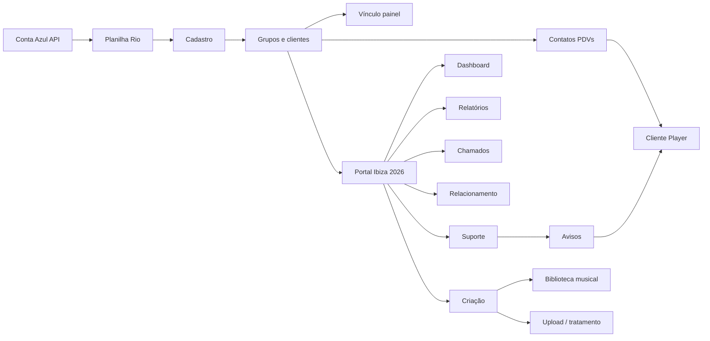

# Portal Ibiza 2026 — usuários, papéis e permissões

Documento de planejamento alinhado ao **mind map** do portal e à equipe atual.  
**Status:** planejamento — implementação em fases (ver §6).  
**Data:** 15/06/2026

Relacionado: [Onde estamos](ONDE-ESTAMOS.md) · [Fase 2 Produção](FASE-2-PRODUCAO-MUSICAL.md)

---

## 1. De portal de cobrança a portal da empresa

O site começou como **cobrança + Conta Azul** (`site-vencidos-ibiza.netlify.app`).  
Hoje já inclui **Cadastros** (Rio × produção) e **Produção** (dashboard + suporte).  
A evolução natural é o **Portal Ibiza 2026**: um lugar para todos os setores, com:

- **Quem vê o quê** (papéis por área)
- **Quem pode alterar o quê** (leitura vs escrita vs admin)
- **Histórico** do que cada pessoa fez (auditoria)

---

## 2. Mapa mental → módulos do portal

Visão do fluxo de dados e telas (mind map):



### Tabela: módulo × rota × estado

| Módulo (mind map) | Rota(s) portal | Estado hoje | Papel principal |
|-------------------|----------------|-------------|-----------------|
| **Conta Azul → Planilha Rio** | `/cobranca/planilha-rio` | ✅ Ativo | Cobrança |
| **Vencidos / cobrança aberta** | `/cobranca/vencidos` | ✅ Ativo | Cobrança |
| **Envios OC** | `/cobranca/envios-oc` | ✅ Ativo | Cobrança |
| **Consulta painel legado** | `/cobranca/consulta-painel` | ✅ Ativo | Cobrança, Suporte, Produção (leitura) |
| **Cadastro → Grupos e clientes** | `/cadastros/grupos` | ✅ Ativo | Cadastros, Produção |
| **Vínculo painel** | `/cadastros/vinculos` | ✅ Ativo | Cadastros |
| **Contatos PDVs** | `/producao/suporte` (+ cadastro PDV) | ✅ Parcial | Suporte, Produção |
| **Dashboard produção** | `/producao/dashboard` | ✅ Ativo | Produção, Master |
| **Relatórios** | — | 🔜 Futuro | Todos (filtrado por papel) |
| **Chamados** | — | 🔜 Futuro | Suporte, Relacionamento |
| **Relacionamento** (histórico, clientes novos, pesquisa) | — | 🔜 Futuro | Relacionamento |
| **Suporte → Avisos** | — | 🔜 Futuro | Suporte |
| **Criação → Biblioteca musical** | — | 🔜 Futuro (Envyron / portal-ibiza) | Criação |
| **Criação → Upload** (mix, trim, tags, dedup) | — | 🔜 Futuro | Criação |
| **Cliente Player** | Fora do Netlify (player + webservice) | Legado + trilho novo | Criação, Produção (config) |

---

## 3. Papéis (roles)

Um usuário pode ter **um ou mais papéis**. **Master** implica acesso total.

| Papel | Código | Descrição resumida |
|-------|--------|-------------------|
| **Master** | `master` | Sócios / TI — tudo, incluindo usuários e auditoria |
| **Cobrança / Financeiro** | `cobranca` | Conta Azul, Rio, vencidos, envios OC |
| **Cadastros** | `cadastros` | Layout produção, vínculos Rio ↔ painel (edição) |
| **Produção** | `producao` | Dashboard operacional, cadastro PDV produção |
| **Suporte** | `suporte` | Contatos PDV, consulta painel, avisos/chamados (futuro) |
| **Relacionamento** | `relacionamento` | Clientes novos, histórico, pesquisa (futuro) |
| **Criação** | `criacao` | Biblioteca, upload, programação (futuro + Envyron) |

### Matriz de acesso (alvo)

Legenda: **V** = ver · **E** = editar · **A** = admin (sync, apagar, config) · **—** = sem acesso

| Área | Master | Cobrança | Cadastros | Produção | Suporte | Relacionamento | Criação |
|------|--------|----------|-----------|----------|---------|----------------|---------|
| Cobrança / Rio / OC | VEA | VEA | V | V | — | V | — |
| Vencidos + e-mail CA | VEA | VEA | — | — | — | — | — |
| Cadastros grupos | VEA | V | VEA | VE | V | V | — |
| Vínculos painel | VEA | V | VEA | V | V | — | — |
| Produção dashboard | VEA | V | VE | VEA | V | V | V |
| Suporte / contatos PDV | VEA | — | V | VE | VEA | V | — |
| Consulta painel | VEA | V | V | V | VE | VE | — |
| Relatórios (futuro) | VEA | subset | subset | subset | subset | subset | subset |
| Chamados / avisos (futuro) | VEA | — | — | V | VEA | VE | — |
| Relacionamento (futuro) | VEA | V | V | V | V | VEA | — |
| Criação / biblioteca (futuro) | VEA | — | — | V | — | — | VEA |
| Admin usuários + audit log | VEA | — | — | — | — | — | — |
| OAuth Conta Azul (conectar) | VEA | VEA | — | — | — | — | — |

*Master sempre VEA em tudo. Ajustes finos por pessoa podem ser feitos depois (exceções).*

---

## 4. Equipe inicial (cadastro alvo)

Login: **e-mail corporativo + senha + Google Authenticator (TOTP)**.  
Gerar senha: `npm run portal:hash-password` · segredo TOTP: `npm run portal:totp-secret -- "Nome"`.

| Nome | E-mail sugerido | Papéis |
|------|-----------------|--------|
| Rafael Gasparian (sócio) | `rafael@radioibiza.com.br` | `master` |
| Pedro Salomão (sócio) | `pedro@radioibiza.com.br` | `master` |
| Rodolfo Gasparian | `rodolfo@radioibiza.com.br` | `cobranca` |
| Anderson Silve | `anderson@radioibiza.com.br` | `suporte` |
| Marize Cristina | `marize@radioibiza.com.br` | `suporte` |
| Renato Antunes | `renato@radioibiza.com.br` | `producao` |
| Vivian Camara | `vivian@radioibiza.com.br` | `relacionamento` |
| Adriana Santagnello | `adriana@radioibiza.com.br` | `relacionamento` |
| Lauro Almeida | `lauro@radioibiza.com.br` | `criacao` |
| Fc Nond | `fcnond@radioibiza.com.br` | `criacao` |
| Mary Olivetti | `mary@radioibiza.com.br` | `criacao` |
| Breno | `breno@radioibiza.com.br` | `criacao` |

Confirme os e-mails reais da empresa antes de gravar na Netlify.

**Configuração:** array completo em `PORTAL_USERS_JSON` (Netlify). Não há mais usuários embutidos no código.

---

## 5. Histórico / auditoria (o que registrar)

Toda **alteração relevante** deve gravar:

| Campo | Exemplo |
|-------|---------|
| Quem | `username` da sessão |
| Quando | timestamp Brasil |
| O quê | `rio.linha.update`, `cadastros.vinculo.create`, `oc.email.send` |
| Onde | competência `202605`, `rioPdvId`, etc. |
| Antes / depois | JSON resumido (opcional por volume) |
| IP / user-agent | opcional |

### Eventos prioritários (Fase 1 audit)

- Planilha Rio: sync CA, import, apagar linha, virada, revert sync  
- Cadastros: vínculo criado/apagado, layout alterado  
- Envios OC: e-mail enviado, anexo, status  
- Cobrança: e-mail agregado enviado, obs/contrato cliente  
- Login / logout (opcional)

### Onde guardar

Tabela Postgres proposta: `portal_audit_log` (não implementada ainda).

Master (e futuramente cada gestor de área) consulta em **Relatórios → Auditoria**.

---

## 6. Implementação em fases (sem big bang)

### Fase A — Documento + config (agora)

- Este arquivo como contrato entre equipe e código  
- Definir usernames e papéis na Netlify (`PORTAL_USERS_JSON` estendido ou doc paralelo)

### Fase B — Sessão com papéis

- JWT inclui `email` e `roles` ✅ (implementado)
- `PORTAL_USERS_JSON` com `roles` ✅
- Menu lateral **esconde** módulos sem permissão (UX) — pendente
- Middleware/API retorna **403** em rotas proibidas — pendente

### Fase C — Auditoria

- Prisma `portal_audit_log` + helper `auditLog({ action, ... })`  
- Chamadas nas APIs de escrita existentes

### Fase D — Portal shell único

- Home `/` com cards por área (Cobrança, Cadastros, Produção, …)  
- Relacionamento, Chamados, Criação conforme mind map  
- Tela Master: gestão de usuários (sem editar `.env` manualmente)

---

## 7. O que NÃO misturar

- **Login portal** (equipe Ibiza) ≠ **OAuth Conta Azul** (ERP financeiro)  
- Papéis do portal **não** substituem roles do Cake legado (`master`, `admin`, `cliente`)  
- Webservice **players** (Envyron) terá auth própria (token PDV) — outro documento

---

## 8. Próximos passos sugeridos

1. **Você confirma** usernames e se alguém precisa de **dois papéis** (ex.: Renato = produção + suporte?).  
2. **Gerar senhas** (`npm run portal:hash-password`) e montar `PORTAL_USERS_JSON` com `roles`.  
3. **Implementar Fase B** no código (próximo sprint de dev).  
4. Atualizar [ONDE-ESTAMOS.md](ONDE-ESTAMOS.md) quando Fase B estiver no ar.

---

## 9. Exemplo — `PORTAL_USERS_JSON`

```json
[
  {
    "email": "rafael@radioibiza.com.br",
    "displayName": "Rafael Gasparian",
    "passwordHash": "$2a$12$...",
    "totpSecret": "JBSWY3DPEHPK3PXP",
    "roles": ["master"]
  },
  {
    "email": "rodolfo@radioibiza.com.br",
    "displayName": "Rodolfo Gasparian",
    "passwordHash": "$2a$12$...",
    "totpSecret": "OUTROSEGREDOBASE32",
    "roles": ["cobranca"]
  }
]
```

Cada pessoa configura o Google Authenticator com o `totpSecret` gerado por `npm run portal:totp-secret`.

---

*Revise este documento quando entrar um módulo novo do mind map ou mudar a equipe.*
